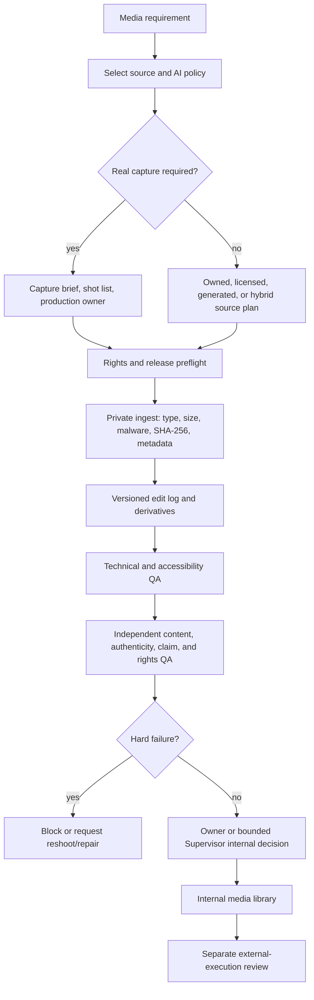

# Media provenance and production workflow

Status: partial read-only preview support is implemented in Local Canvas. When a verified work order already contains a valid, declared PNG/JPEG/WebP/MP4/WebM artifact, the authorized local endpoint can serve it to the channel preview after re-verifying job evidence, exact hash, byte limit, file signature, and tenant path. Upload/ingest, safe proxy generation, rights evidence collection, editing, media production, and publishing remain inactive. Incubating contracts are not promoted into the active production contract index.

## Current capability audit

The current framework has a useful policy skeleton but not a complete media-production lane.

| Capability | Current alpha | Practical meaning |
| --- | --- | --- |
| Visual direction in a content package | Partial | `visualBrief` can describe source, reference, rights, provenance, accessibility, storyboard, and transcript. |
| Rights/provenance hard failure | Partial | Unknown rights or missing provenance can block a draft during lint and independent QA. |
| Owner evidence review | Implemented for text; binary media preview is partial | The Content workspace shows verified copy, QA evidence, source metadata, version and decision history. A separate bounded endpoint may render only hash-bound image/video artifacts already declared in that work order. |
| Full copy and version review | Implemented for text artifacts | The `Nội dung` area lists pending, approved and revision-requested records and renders complete localized copy alternatives. |
| Channel copy + media preview | Implemented as a bounded simulation | Facebook, Instagram, LinkedIn, and blog layouts compose the selected text variant with the selected verified media file. If no file exists, Canvas labels that the visual brief is text only. It does not guarantee the live platform's exact rendering. |
| Image/video preview | Partial | A manager can view an attached, verified image or play a browser-supported video. There is no gallery, crop comparison, frame annotation, transcoding, or media-version management. |
| Binary media ingest and private storage | Not implemented | There is no tenant media library, resumable upload, malware scan, checksum ingest, metadata stripping, or retention workflow. |
| Real-world capture operation and edit | Not implemented | There is no shot-list assignment, capture receipt, camera-original binding, release collection, edit history, or reshoot loop. A future `real_capture_only` lane may allow crop, conventional colour correction, subtitles, and a brand-layout overlay while preserving the source original and hash; generative fill or synthetic additions must be blocked. |
| Generative media production | Not implemented by the framework | A Coding Agent may use a locally available image/video skill only when the brief permits generation. The currently callable Codex environment has native `imagegen` and optional Remotion/HyperFrames and animation skills; other Coding Agent installations are not assumed to have them. The framework itself does not install plugins or create media through a vendor API. |
| Controlled publishing | Not implemented | W4 remains deferred. An internal approval does not authorize upload, scheduling, posting, or ad spend. |

This distinction matters: a rights label inside a copy package is an assertion. A production-ready media lane needs evidence that binds the request, original files, edits, releases, QA, and approvals to exact hashes.

## Source policy is selected before production

Every media request must choose one origin policy. “Use real media” cannot be a note buried in a prompt.

| Required origin | Allowed examples | Automatically blocked examples |
| --- | --- | --- |
| `real_capture_only` | Camera originals captured for the request; non-generative cut, crop, colour, audio mix, captions | Generated background, generated object, generative fill, synthetic voice, synthetic person, face swap, generated product state |
| `owned_or_commissioned_real_media` | Existing tenant-owned originals or commissioned human production with evidence | Stock or generated media unless a new request version explicitly allows it |
| `owned_or_licensed_non_generated_media` | Owned material and licensed photography/video/audio with current scope | Unknown source, expired licence, generated or hybrid media |
| `any_approved_non_generated_media` | Real capture, owned, commissioned, or licensed media after rights review | Generated or hybrid media |
| `generation_permitted` | Generated or hybrid media inside the declared operations and disclosure policy | Synthetic identity media; any undeclared generation; use outside approved scope |

AI may still help draft a shot list, caption, transcript, or production checklist when generation is forbidden. Those operations do not permit synthesized pixels, frames, voices, people, or product evidence. Each actual edit is classified as `non_generative`, `generative`, or `administrative` in the asset record.

## End-to-end workflow

### 1. Requirement and source policy

The campaign owner chooses media kind, channel-safe formats, source modes, mandatory real-world evidence, AI-use policy, prohibited operations, accessibility needs, review roles, and the reason for the restriction. The request becomes immutable at production start; a policy change creates a new version.

### 2. Capture or sourcing brief

For real production, the brief records shot purpose, framing, required product state, talent class, audio need, safe location class, capture window, production owner, and acceptance criteria. It references people, places, agreements, and product evidence by private IDs. It does not copy personal details or exact location data into the portable manifest.

For owned or licensed material, the sourcing brief records the desired subject, provenance standard, territories, channels, commercial-use scope, duration, modification rights, and expiry requirements before selection begins.

### 3. Rights preflight

The rights reviewer determines which evidence is required:

- ownership, work-for-hire assignment, or licence;
- model/talent release for identifiable people;
- location release where required;
- property, artwork, logo, and trademark clearance;
- music, voice, sound-effect, and performance rights;
- permitted channels, territories, commercial use, modifications, and term.

Unknown, expired, revoked, or mismatched scope is a hard failure. A release record stores a reference and reviewed scope; subject identity stays in the tenant’s protected rights system.

### 4. Private ingest and evidence binding

Ingest must run before Canvas offers a review:

1. allow-list MIME type and verify file signature;
2. enforce size/duration/resolution limits and scan for malware;
3. write to tenant-private storage with a non-public identifier;
4. calculate SHA-256 and byte count from the stored file;
5. strip raw GPS and other sensitive metadata unless an owner explicitly retains reviewed metadata;
6. preserve camera originals and record every derived file;
7. forbid training or reuse of raw media without a separate opt-in;
8. add an append-only ingest event.

An approval binds the exact file hashes plus a manifest hash. Crop, edit, caption, audio, rights scope, destination, channel, term, or file replacement invalidates the affected approval.

### 5. Production and edit history

The production agent may coordinate a human shoot, select owned/licensed media, or invoke a future generation adapter only when the request permits it. Every output records its input hash, output hash, operation class, operator role, tool reference, and time.

A real-capture request fails if any media synthesis is detected or declared. Non-generative operations such as selection, cut, crop, conventional colour correction, audio mix, compression, subtitles, and format conversion remain allowed when the brief permits them.

### 6. QA and review gates

The producer cannot review its own output. At minimum:

- technical QA checks dimensions, codec, duration, audio, captions, frame-safe layout, and file integrity;
- authenticity QA checks actual origin against the request and edit log;
- content QA checks ProductTruth, claim context, brand, locale, emotional safety, and destination fit;
- rights QA checks ownership, releases, licence scope, term, territory, channel, and commercial use;
- accessibility QA checks alt text, captions, transcript, contrast/readability, and flashing content.

Hard failures cannot be overridden by a Supervisor. Repair creates a new media version and repeats every affected gate.

### 7. Internal approval and publishing boundary

Internal approval adds the asset to a reviewed media library. It still cannot post or spend. A later execution envelope must bind the current media manifest hash, copy version, claim evidence, destination, channel, schedule window, account owner, rollback path, expiry, and budget cap when relevant. Execution produces a receipt that is compared with the approved envelope.

## Manager-facing Canvas requirements

The current Canvas implements the review inbox, full text-content detail, and bounded preview of existing binary work-order artifacts. The wider media detail remains an incubating requirement:

1. **Review inbox — implemented for W2 text artifacts:** filters `needs review`, `approved internal`, and `revision requested`, with the selected task state and decision actions.
2. **Content detail — implemented for W2 text artifacts:** full localized alternatives, current artifact integrity, media/source metadata contained in the package, QA rubric, versions, and decision history.
3. **Channel preview — partial:** channel-layout simulations include full copy and a selected, hash-verified media artifact. A task with only a visual brief shows a clear missing-file state. These simulations are not platform SDK output or publish previews.
4. **Media operations detail — not implemented:** complete image gallery and video/audio operations, original/derivative lineage, real/generated/licensed badge validation, edit history, shot-list coverage, accessibility validation, rights/releases and expiry checks, independent media QA, and approval invalidation warnings.

Raw technical JSON remains downloadable for audit, but it should not be the primary manager interface. Media files must be streamed from tenant-private storage through an authorized endpoint; Canvas must never expose a storage path as a public URL.

## Contract map

- [`media-production-request.schema.json`](../packages/growth-contracts/extensions/media-production-request.schema.json) freezes origin, generation, capture, rights, upload, QA, and approval requirements before work begins.
- [`media-asset-record.schema.json`](../packages/growth-contracts/extensions/media-asset-record.schema.json) binds actual files and derivatives to evidence, edit history, rights, QA, and approvals.
- [`media-real-capture.request.example.json`](../packages/growth-contracts/examples/media-real-capture.request.example.json) shows a real-only request.
- [`media-real-capture.asset-record.example.json`](../packages/growth-contracts/examples/media-real-capture.asset-record.example.json) shows the resulting internal record.

These records intentionally stop before publishing. Promoting them into the active contract index requires the storage, authorization, scanner, viewer, rights, QA, invalidation, and audit behaviors described above.

## Manager-testable acceptance criteria

A real-capture pilot is complete only when a non-technical manager can:

1. create a request that visibly says generative media is forbidden;
2. open the shot list and assign the human production owner;
3. upload a camera original and see its checksum, safe proxy, and metadata status;
4. attach release/licence references without exposing subject identity in the portable record;
5. compare original and edited versions and see only declared non-generative operations;
6. play the final video or inspect the image at review size with captions/alt text;
7. see independent technical, authenticity, content, rights, and accessibility verdicts;
8. approve it for the internal library while Canvas clearly states that publishing is still unauthorized;
9. change a file or rights scope and observe that the prior approval is invalidated.
