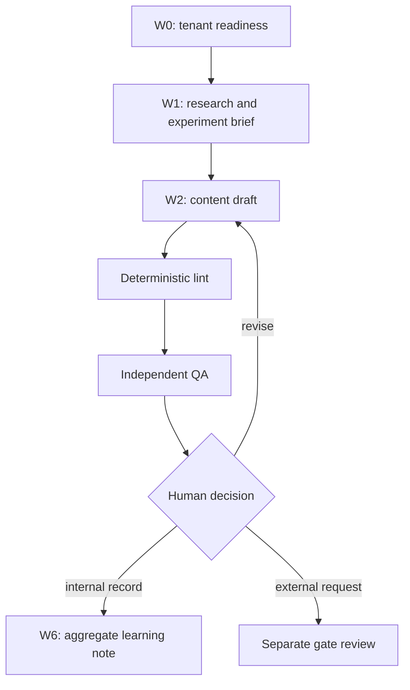

# Operating Model

The operating model separates creative production from truth, quality, and execution authority. Agents prepare bounded artifacts; named humans decide scope, claims, and any future execution. This separation makes the framework reusable without allowing a generic workflow to act as a marketing channel.

## Agent roles and hard boundaries

| Role | Produces | Must stop before |
| --- | --- | --- |
| Growth orchestrator | Scope, job sequence, gates, and learning-note routing | External action, access material, budget, or product change |
| Research and JTBD | Approved-source summaries and audience/job hypotheses | Outreach, sensitive inference, or a market conclusion presented as fact |
| ProductTruth claim guard | Claim allow/block decision tied to current evidence | Overriding evidence or inventing a claim |
| Positioning experiment | Evidence-bounded positioning and experiment brief | Selecting an external audience or making an offer |
| Content studio | Locale-complete concept, copy, visual brief, and provenance references | Self-approval, unlicensed material, or execution |
| Independent QA | Claim, safety, privacy, rights, locale, accessibility, and traceability verdict | Overriding a hard failure |
| Distribution planner | Channel-specific draft package and preflight checklist | Channel login, scheduling, posting, sending, or receipt collection |
| Journey measurement | Aggregate metric plan and learning note | Individual-level behavior analysis or product change |

## Skill catalog and sub-agent cells

The portable skill catalog defines eight bounded skills: readiness, research, positioning, content factory, quality gate, journey measurement, execution preflight, and learning synthesis. The portable topology groups the roles into five cells: readiness, research, content, quality, and learning.

Each cell may use narrowly scoped sub-agents for checking or drafting, such as evidence-reference checking, identity-boundary checking, source review, locale editing, visual-accessibility review, claim linting, privacy linting, metric-denominator checking, and aggregate-privacy checking. A sub-agent receives only the minimum sanitized input required for its assigned task. It may not approve, execute, spend, access a secret, or alter a product.

The execution-preflight skill documents future W3, W4, and W5 requirements, but those workflows remain deferred in the first release. Its presence does not activate distribution, controlled publishing, or paid-media capability.

## Workflow sequence

The initial operating state ends at the human decision. `H` is an application for a later gate; it is not an instruction to execute.

## Artifact handoff requirements

Every W1 or W2 artifact must have:

- a stable identifier and workflow version;
- named tenant and owner;
- current ProductTruth references and evidence expiry;
- a clear audience/job hypothesis rather than a sensitive targeting claim;
- copy coverage for every locale required by the tenant's locale policy;
- visual-rights and accessibility status;
- target-surface fit and a destination status;
- deterministic lint outcome, independent QA outcome, and repair history;
- an approval state no later than `qa_pass_pending_human` during the first release.

Changes to copy, visual brief, claim reference, destination, target channel, schedule, or budget invalidate any prior approval envelope.

For a Canvas job, the work-order lead writes only the lead run receipt and must leave `qualityGateStatus` as `not_run`. Before an independent reviewer can record a pass, the framework computes `deterministic-lint.json` from the exact artifact bytes plus current BrandPack, ProductTruth, and role-mapping bytes. The receipt validates the W2 `concept_copy_package` contract, internal-only authority, claim evidence, locale/accessibility coverage, rights/provenance, sensitive-data rules, and hard-fail copy patterns. A separate role resolved from the tenant's `quality_assurance` mapping writes `qa-verdict.json`; that role must differ from the assigned lead and bind the active claim attempt to the same SHA-256 and byte count of every reviewed artifact. Completion and owner review recompute the deterministic receipt and rehash those artifacts, so a reviewer cannot self-declare lint success. A revision archives the prior attempt records and artifact bytes before a new attempt may begin.

## Quality controls

Hard failures block the artifact. Examples include a malformed artifact contract, unsupported or expired claims, deterministic prediction, sensitive advice or guarantees, persona impersonation, unknown rights, data leakage, missing provenance, localization/accessibility failure, cross-tenant leakage, stale approval, and duplicate execution intent.

Soft quality dimensions score audience relevance, differentiated value, claim precision, editorial quality, CTA fit, visual/accessibility fit, trust, measurement quality, and operational traceability. Internal libraries require zero hard failures, no weak dimension below the threshold, an acceptable mean score, complete provenance, and limited repair cycles.

## Human decision rhythm

| Moment | Decision | Required evidence |
| --- | --- | --- |
| Start of W0 | Accept or block tenant readiness scope | Onboarding pack and owner map |
| Start of W1 | Accept research scope | Source register, jobs hypothesis, data boundary |
| End of W2 | Keep, revise, or block an internal draft | Lint, independent QA, ProductTruth, rights, accessibility review |
| End of W6 | Triage a learning note | Aggregate metrics, privacy-export verdict, product impact |
| Before E1 or later | Decide whether a separate release review may begin | Current evidence, visual rights, destination proof, and named owners |

No schedule, channel connection, message delivery, paid action, or product change happens automatically at any point in this rhythm.

## Operational stop conditions

Stop the workflow and escalate to the relevant owner when:

- a claim is not supported by current ProductTruth;
- source rights, visual provenance, or localization quality are uncertain;
- a direct identifier or restricted data class appears in an artifact;
- the artifact contains another tenant's identity, material, or evidence;
- an approval is stale or an execution intent is duplicated;
- a channel has no rollback path, owner, or receipt mechanism.

Record the block reason, affected artifact, owner, and next required decision. Do not silently rewrite evidence or continue with a weaker gate.
