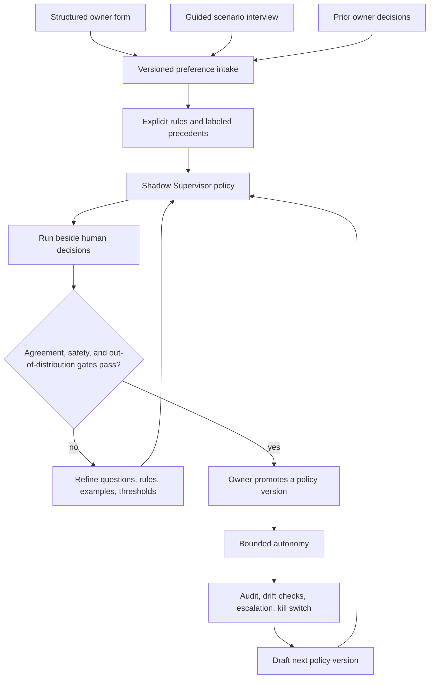

# Pro Supervisor operating model

Status: product and contract design for a Pro tier. The local alpha still uses human owner decisions. The incubating schemas do not activate a Supervisor or external execution.

## Product interpretation

“100% automatic operation” is feasible for routine decisions inside an explicit, versioned operating envelope. It should mean that the owner does not need to approve every normal draft, revision, schedule, or bounded optimization after calibration. It must not mean that an agent silently acquires unlimited authority or pretends to be the owner.

The defensible value is a **versioned operating policy** that reflects the owner’s declared goals, trade-offs, examples, and real decision history. Calling it a personality clone would overstate what the system knows. The Supervisor acts as an agent under that policy, records its reasoning and evidence, and escalates unfamiliar, high-impact, or conflicting cases.

## Supervisor team

One Supervisor should not judge every domain. The Pro control plane can compose bounded supervisors:

| Supervisor | Routine scope | Must escalate |
| --- | --- | --- |
| Brand and editorial | Tone, clarity, hierarchy, locale, CTA, approved visual direction | New positioning, conflicting brand rules, high novelty |
| ProductTruth and claims | Match copy to current approved evidence | New claim, expired/conflicting evidence, regulated claim |
| Media rights and authenticity | Source policy, release/licence completeness, edit provenance | Unknown origin, missing rights, synthetic identity, real-only policy conflict |
| Growth and experiment | Select approved variant, prioritize hypothesis, evaluate aggregate metrics | New audience class, unclear denominator, sensitive targeting, major strategy change |
| Channel operations | Execute within approved destination, schedule, frequency, receipt, rollback | New account/channel, credential change, missing rollback, platform-policy uncertainty |
| Spend operations | Adjust inside an approved cap and kill-switch policy | Cap increase, attribution failure, abnormal spend, new targeting class |
| Meta Supervisor | Resolve routing, policy scope, confidence, novelty, risk, and escalation | Any conflict between supervisors or separation-of-duties failure |

Independent QA remains separate from both producer and Supervisor. A Supervisor can accept or reject a QA-passed item; it cannot erase a hard failure or author its own evidence.

## Calibration flow

### Structured form

The form captures facts that can be reviewed and corrected:

- business objective, success definition, priority order, and acceptable trade-offs;
- audience jobs, exclusions, and sensitive-targeting boundary;
- positioning, proof standard, required ProductTruth, and prohibited claims;
- voice, visual preferences, examples to emulate/avoid, and non-negotiable brand rules;
- media origin rules, generation restrictions, authenticity expectations, and rights standard;
- channel role, frequency, destination, response policy, and rollback expectation;
- experiment metric, denominator, guardrails, budget/frequency caps, and stop conditions;
- what may be automated, what always escalates, escalation owner, and response deadline.

### Guided interview

The system presents paired options and concrete scenarios instead of asking only broad preference questions. It asks the owner to choose, explain why, and name what would change the answer. Examples include:

- specific proof-led copy versus emotional but less specific copy;
- real capture versus generated visual for a trust-critical message;
- stronger CTA versus lower-pressure CTA at different journey stages;
- continue versus pause when volume rises but qualified conversion falls;
- repair versus reject when rights or claim evidence is incomplete;
- whether a new format is close enough to precedent or must escalate.

The stored output is a structured decision and rationale. Raw private interview transcripts, credentials, customer identifiers, and unrelated personal material are excluded by default.

### Decision history

Past decisions become labeled precedents only after they are bound to the artifact version, policy/config version, outcome, reason codes, and owner role. The system records disagreements, not just approvals. It separates:

- a stable rule (`must`, `must not`);
- a strong preference;
- a contextual preference;
- a one-off exception with expiry;
- an unresolved or contradictory decision that needs clarification.

History may propose a new policy version. It never edits the active policy by itself.

## Decision calculus

Self-reported model confidence is insufficient. The decision record uses independently inspectable components:

- **evidence coverage** — required ProductTruth, rights, QA, destination, and measurement evidence present;
- **precedent similarity** — similarity to owner-labeled cases in the same domain, format, journey stage, claim class, media source, and impact class;
- **novelty** — new claim, audience, format, media origin, channel, destination, budget range, market, or policy combination;
- **risk** — privacy, rights, safety, regulatory, reputation, platform, spend, and reversibility exposure;
- **impact** — internal-only, reversible external, material external, or critical/irreversible;
- **calibrated confidence** — held-out agreement for the relevant decision class, adjusted downward for missing evidence and distribution shift.

A bounded automatic decision requires all thresholds to pass, no hard failure, no policy conflict, separation of duties, and an unexpired authorization envelope. Any single failure routes to escalation and fails closed.

An initial conservative profile should require:

- 100% evidence coverage;
- at least 0.90 calibrated confidence;
- at least 0.85 precedent similarity;
- no more than 0.20 novelty and 0.15 risk;
- low impact only;
- zero critical false approvals during shadow evaluation.

Each tenant tunes these thresholds only through a new approved policy version.

## Operating modes

### 1. Draft

The policy is incomplete. Supervisor decisions are disabled.

### 2. Shadow

The Supervisor decides without seeing the human result, records its proposed outcome, and applies nothing. The human makes the real decision. The evaluation compares outcomes and reasons by decision class and explicitly tests unfamiliar/adversarial cases.

### 3. Advisory

The Supervisor displays a recommendation, matched rules, closest precedents, missing evidence, and uncertainty. The human remains the decision-maker. This phase helps find misleading explanations and automation bias.

### 4. Bounded autonomy

The Supervisor may apply an enumerated decision only inside an unexpired envelope. Examples:

- accept, reject, request revision, or select a variant for internal content;
- approve a media item into the internal library after independent QA and rights verification;
- later, schedule or publish through a previously approved channel envelope;
- later, adjust an experiment within a fixed range, spend cap, targeting boundary, and kill-switch policy.

It cannot expand its own scope, change policy, approve new claim evidence, ignore rights, create a new targeting class, increase a budget cap, access/rotate credentials, suppress audit events, or impersonate the owner.

### 5. Suspended or revoked

Drift, audit gaps, abnormal outcomes, policy conflicts, critical false approvals, rights/evidence failure, or the owner kill switch immediately suspends automatic decisions. In-flight external actions follow their defined cancellation and rollback behavior.

## Promotion gate

A policy version should not reach bounded autonomy until all of the following are true:

1. at least 30 representative shadow decisions exist, with enough examples in every enabled decision class;
2. overall agreement is at least 90% and each decision class reaches at least 85%;
3. there are zero critical false approvals and every hard failure is blocked;
4. held-out and out-of-distribution scenarios pass;
5. disagreements are categorized and the policy is revised or explicitly narrowed;
6. audit binding, separation of duties, escalation delivery, expiry, and kill switch are tested;
7. the owner signs the exact policy hash, authority scope, thresholds, and expiry.

These are starting criteria, not universal proof of safety. Paid media, regulated claims, sensitive data, and irreversible actions require higher sample sizes and narrower envelopes.

## Audit and explainability

Every decision must bind:

- exact artifact ID, version, and SHA-256;
- exact Supervisor policy ID, version, and hash;
- independent QA result and evidence references;
- matched rules and precedents;
- evidence coverage, similarity, novelty, risk, impact, and calibrated confidence;
- proposed and applied outcome, reason codes, explanation, and escalation;
- producer, QA, Supervisor, and execution roles;
- external execution envelope and receipt when an external action occurs;
- append-only previous-event and current-event hashes.

The owner dashboard needs agreement by decision class, false-approval count, escalation rate, policy drift, outcome metrics, active envelopes, rights/claim expiry, incidents, and the kill switch. An explanation should show why a rule applied and what evidence was missing; it must not expose hidden model reasoning or present a generated rationale as proof.

## Contracts

- [`supervisor-preference-intake.schema.json`](../packages/growth-contracts/extensions/supervisor-preference-intake.schema.json) stores verified answers and labeled decision scenarios.
- [`supervisor-policy-profile.schema.json`](../packages/growth-contracts/extensions/supervisor-policy-profile.schema.json) defines authority, domains, thresholds, activation, learning, audit, and kill-switch policy.
- [`supervisor-decision-record.schema.json`](../packages/growth-contracts/extensions/supervisor-decision-record.schema.json) records each shadow, advisory, or bounded decision.
- The [`intake`](../packages/growth-contracts/examples/supervisor-preference-intake.example.json), [`policy`](../packages/growth-contracts/examples/supervisor-policy-profile.example.json), and [`shadow decision`](../packages/growth-contracts/examples/supervisor-shadow-decision.example.json) examples are fictional and external-action-free.

## Delivery sequence

1. **Decision visibility first** — build detailed content/media review and reliable reason-code capture so the system has trustworthy labeled decisions.
2. **Preference intake** — add the structured form, scenario interview, owner correction, versioning, and retention controls.
3. **Shadow Supervisor** — calculate decisions, thresholds, and explanations without applying them; measure by decision class.
4. **Internal bounded autonomy** — automate internal accept/revise/reject/variant selection under strict gates and a kill switch.
5. **Media bounded autonomy** — add source-policy, rights, authenticity, and media QA after the media-production workflow exists.
6. **External bounded autonomy** — only after controlled publishing has authenticated accounts, idempotency, receipts, rollback, incident response, and an execution-envelope model.
7. **Spend optimization** — last, with consented attribution, budget/frequency caps, anomaly detection, reconciliation, and immediate pause.

The first two steps are prerequisites. Without detailed review records and consistent reason codes, the Supervisor would imitate sparse outcomes rather than the owner’s actual operating policy.

## Manager-testable acceptance criteria

A shadow Supervisor pilot is complete when a non-technical owner can:

1. answer the form and scenario interview, then review and correct the structured summary;
2. distinguish non-negotiable rules, preferences, contextual exceptions, and unresolved conflicts;
3. see the exact domains and decisions the Supervisor may and may not make;
4. run the Supervisor in shadow without affecting the human decision or external state;
5. compare its decision and reason codes with the human decision by class;
6. inspect evidence coverage, precedent similarity, novelty, risk, impact, and calibrated confidence;
7. see every threshold failure escalate instead of silently approving;
8. verify that producer, independent QA, and Supervisor are different roles;
9. promote a specific policy hash only after the evaluation gate passes;
10. suspend the policy with one kill-switch action and observe fail-closed behavior.

\n