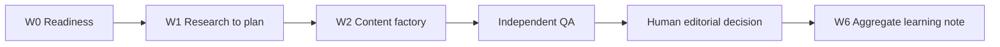

# Start Here

> **Chủ doanh nghiệp hoặc quản lý marketing:** bắt đầu từ [Hướng dẫn nhanh không cần viết code](MANAGER_QUICK_START.vi.md). Hướng dẫn cài đặt kỹ thuật cho người quản trị vẫn nằm trong tài liệu này.

For the internal approval boundary, post-publication lifecycle, and reporting plan, see [Content lifecycle and reporting](CONTENT_LIFECYCLE_AND_REPORTING.vi.md).

Use this guide to give a new business the same initial AI-marketing operating capability as every other tenant of the framework. The target is a safe, internally useful preparation system: readiness, research briefs, content drafts, independent QA, and aggregate learning notes. It is not a launch authorization.

## Decide the operating boundary first

Before installing the framework, name the following accountable roles for the new business:

| Decision | Required owner | Why it exists |
| --- | --- | --- |
| Tenant identity and BrandPack | Business owner | Prevents cross-tenant brand and claim reuse |
| ProductTruth and feature evidence | Product owner | Prevents unsupported product claims |
| Consent and data map | Privacy owner | Defines which data may enter each workflow |
| Content and editorial decisions | Editorial owner | Reviews draft quality and public-material candidates |
| Channel capability and execution | Channel owner | Owns any future controlled publish path |
| Budget and paid-media decision | Budget owner | Prevents unbounded spend |
| Incident response | Incident owner | Provides a stop and recovery decision point |

If any owner is unknown, record the tenant as blocked and do not start W1 or W2.

## Establish the official adoption topology

The recommended pilot topology is **release-tagged vendoring**, not a floating branch or an unpinned submodule:

```text
private-tenant-repository/
  framework/   reviewed clean export from one upstream release tag; no tenant edits
  tenant/      tenant-owned BrandPack, ProductTruth, research, drafts, approvals, and learning records
```

The upstream framework repository remains tenant-neutral and publishes reviewed release tags. A tenant vendors the exact clean export from one approved tag into `framework/`, records that tag in its onboarding manifest's `frameworkVersion`, records the source revision in a tenant-controlled adoption decision record, and keeps tenant work in `tenant/`. Run framework commands from `framework/` and supply `../tenant` when a command needs a tenant root.

Do not use an unpinned branch as a tenant dependency during the pilot. Do not edit the vendored core to bypass a control; propose a sanitized upstream change instead.

The tenant workspace also needs its own backend project, analytics property, sender domain, and secret store. Do not use a shared database with only a tenant label as the isolation mechanism.

## Verify the portable baseline

Run the framework checks before importing any tenant-specific work:

```sh
npm install
npm run validate
npm test
npm run tenant:two:validate
```

If a check fails, repair the portable framework or restore a known-good version. Do not work around a failed control by editing a synthetic fixture or lowering a threshold.

## Create the tenant scaffold and complete W0: readiness

From `framework/`, create the private tenant workspace with `npm run tenant:init -- --tenant <slug> --output ../tenant`. Replace its placeholder values only with facts and evidence owned by the new business. The scaffold is a field guide, never a source of business facts. Complete the following minimum set:

1. Tenant configuration with a stable tenant identifier and owned brand tokens. A real tenant never needs to disclose or store another tenant's real identity token.
2. BusinessPack with target market, locale, value hypothesis, activation event, allowed channel list, and named owners.
3. ProductTruth with feature/build/platform evidence, allowed claims, prohibited claims, evidence expiry, and allowed surfaces.
4. BrandPack with voice, terminology, visual-rights policy, accessibility rules, and localization rules.
5. Role mapping that assigns the tenant's people or approved agents to all portable framework capabilities.
6. Readiness record, onboarding manifest, consent and data map, event ownership map, journey map, channel capability matrix, research source register, and risk register.
7. Empty internal registries for briefs, content drafts, approvals, and learning notes; do not populate them with external-execution data.

The W0 result is either `ready_for_internal_drafts` or `blocked`. It is never `ready_to_publish`.

## Run the first internal cycle

After W0 passes, run the workflows in order:



- W1 creates a research scope, audience/job hypothesis, experiment brief, and measurement plan from approved inputs.
- W2 creates internal concepts, copy, visual briefs, deterministic lint results, and independent QA verdicts.
- W6 produces only aggregate, de-identified learning notes and product-ticket drafts for product-owner triage.

Do not contact people, upload an audience, schedule a post, send a message, or buy media in this cycle.

Before a manager reviews an internal draft, validate its W1/W2 records. If an owner-configured AI runtime will generate a draft, first create its non-secret job manifest:

```sh
npm run tenant:artifact:validate -- --tenant-root <private-tenant-directory>
npm run tenant:job:prepare -- --tenant-root <private-tenant-directory> --workflow W2_content_factory --job-id <safe-id> --output <private-tenant-directory>/jobs/<safe-id>.json
```

The framework does not invoke a model provider itself. An `owner_configured` provider adapter requires the tenant owner to configure that runtime, credential storage, privacy controls, and provider policy. The default `coding_agent_handoff` adapter uses the owner's existing Coding Agent subscription and does not ask the framework user for an LLM API key.

For the no-key local pilot, use the structured Coding Agent handoff instead of configuring an LLM API key:

```sh
npm run canvas:build
npm run canvas:start -- --workspace ../tenant --port 4310
```

The Canvas validates W0 before creating a job, writes an immutable tenant-scoped work order, and provides the exact manual handoff. Read [Local Canvas](LOCAL_CANVAS.md) for claim, completion, QA, content review, owner decisions, and fallback behavior. Media provenance and Pro Supervisor contracts remain incubating; review [Media Provenance Workflow](MEDIA_PROVENANCE_WORKFLOW.md) and [Pro Supervisor Operating Model](PRO_SUPERVISOR_OPERATING_MODEL.md) before implementing either runtime.

The content lead and independent QA must use different tenant-mapped roles. The lead claims and drafts, the QA role writes the attempt-bound artifact-hash verdict, and only then may the lead completion receipt move a passing package to owner review. A revision always uses a new attempt while preserving the prior attempt archive.

For an owner-produced non-synthetic learning export, validate the file before a product owner reviews it:

```sh
npm run tenant:learning:validate -- --tenant-root ../tenant --export-path ../tenant/learning/exports/<aggregate-learning-export>.json
```

The validator requires W0 `ready_for_internal_drafts`, a privacy pass, an opaque alias, and compatible workflow/metric versions. It only reads an aggregate export and does not perform external work.

## First manager review

The manager can test the new tenant setup by checking that:

1. All baseline checks pass in the portable framework repository.
2. The tenant workspace has a complete W0 record and named owners.
3. Every draft cites current ProductTruth references and stays in `qa_pass_pending_human` or an earlier state.
4. A deliberately unsupported claim, a test-only isolation sentinel, and a direct identifier each trigger a block in the tenant's local QA test.
5. Any learning record uses the aggregate `LearningExport` contract and no tenant source material crosses into the portable repository.

## What comes next

Read [Tenant Onboarding](TENANT_ONBOARDING.md) for the required W0 artifact set and [Artifact Examples](ARTIFACT_EXAMPLES.md) before adding W1/W2 records, then [Operating Model](OPERATING_MODEL.md) for daily handoffs. Use [Governance](GOVERNANCE.md) before proposing any move beyond internal draft work.
