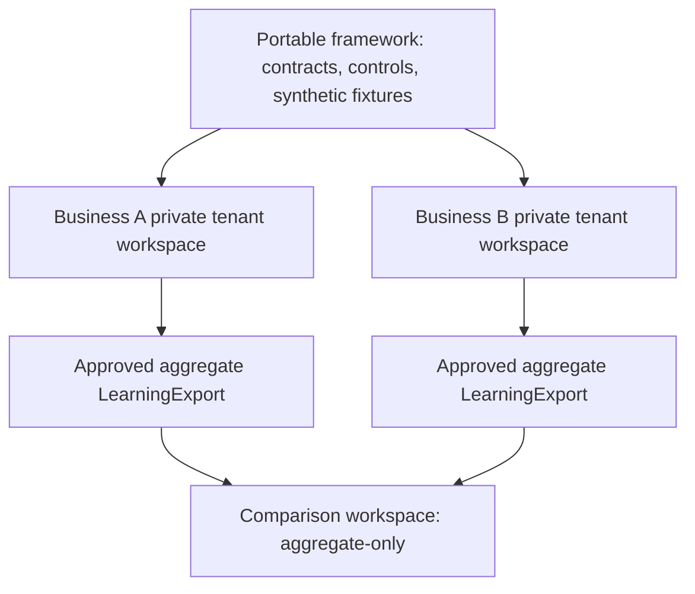

# Two-Business Pilot

The two-business pilot tests whether one portable framework produces consistent preparation quality for two independent businesses without mixing their identity, evidence, customers, or operational authority. It accelerates learning about the framework, not the transfer of one business's marketing materials to another.

## What "equivalent capability" means

Both businesses use the same versioned contracts, workflow definitions, quality rubric, adversarial tests, approval-state rules, and onboarding standard. They do **not** need the same product, audience, language, message, channel, data model, or readiness state.

## Required topology



The comparison workspace receives only approved de-identified aggregate learning exports. It must not receive BrandPacks, ProductTruth evidence, customer records, source content, creative files, destination data, approval envelopes, access material, or execution receipts.

Run one Local Canvas process per business on separate loopback ports. Each process receives one private tenant root and cannot register the other business. Do not create a convenience tenant switcher that gives one browser process access to both raw workspaces. Any future comparison view must consume only validated LearningExport records.

## Entry criteria for each business

Before the pilot starts, each business must independently:

1. Pass the portable framework validation and adversarial tests.
2. Complete its own W0 onboarding pack and assign all required owners.
3. Confirm separate backend, analytics, sender identity, secret store, and audit storage.
4. Define its own non-production isolation-test sentinel; no real foreign-tenant identity token is required.
5. Define one internal activation hypothesis and aggregate measurement plan.
6. Confirm that all channels remain draft-only unless a separate E1, E2, or E3 review later authorizes a narrow action.

If one business is blocked, the other may continue its internal work. A blocked business does not lower the standard for either tenant.

## Pilot phases

| Phase | Per-business activity | Shared comparison input | Exit condition |
| --- | --- | --- | --- |
| 0. Baseline | Install the same framework version and pass synthetic conformance tests. | Framework version and test result only | F1 pass for both |
| 1. Readiness | Complete W0 and negative isolation tests. | Readiness status, no source artifacts | Each business has its own accountable owners |
| 2. Research | Run W1 from separate approved sources and data boundaries. | Versioned rubric coverage only | Internal brief accepted or revised |
| 3. Content | Run W2 and independent QA for separate internal drafts. | Aggregate QA outcome counts and repair-cycle buckets | Each asset remains internal and traceable |
| 4. Learning | Run W6 on approved aggregate signals. | `LearningExport` only | Privacy-export verdict passes |
| 5. Review | Compare framework quality, not private content. | De-identified aggregate summaries | Owner chooses framework improvements |

## Comparison protocol

Compare the businesses by common operating signals:

- rate of W0 completion and block reasons by category;
- hard-fail category counts and repair-cycle buckets;
- rubric dimension distributions;
- time/version required to move from brief to human-reviewable draft;
- aggregate activation and repeat-value buckets only when both tenants have approved collection;
- quality-control changes that improve both tenants without importing a tenant-specific claim.

Do not rank businesses on private source material, customer identity, detailed performance data, or individual behavior. Do not use a higher result from one business as proof that another business may make the same product claim. During synthetic isolation testing only, a test runner may inject a counterpart's owned test marker into an ephemeral fixture copy; it must not be retained by either tenant.

## Validate and compare aggregate learning records

Each owner validates its own non-synthetic export first. From the appropriate vendored `framework/` directory, run:

```sh
npm run tenant:learning:validate -- --tenant-root <private-tenant-directory> --export-path <private-tenant-directory>/learning/exports/<aggregate-learning-export>.json
```

The export must come from a W0-ready tenant and have a privacy pass, opaque tenant alias, and compatible workflow and metric-definition versions. A comparison operator may then run a read-only comparison using tenant-controlled paths:

```sh
npm run tenant:learning:compare -- --tenant-a-root <private-tenant-a-directory> --tenant-a-export-path <tenant-a-export-path> --tenant-b-root <private-tenant-b-directory> --tenant-b-export-path <tenant-b-export-path>
```

The comparison emits only de-identified aggregate projections. It never sends, publishes, invokes a channel, or executes a campaign. `tenant:learning:demo` is synthetic conformance coverage only; its internal synthetic allowance must not be used for a real tenant export.

## Shared improvement loop

1. Each tenant owner creates a privacy-reviewed aggregate learning export.
2. A framework reviewer checks the export against the learning contract and cohort threshold.
3. The comparison group identifies a reusable control, workflow, fixture, documentation, or rubric improvement.
4. The change enters the portable repository as a tenant-neutral pull request with an adversarial test.
5. Each tenant owner independently decides whether to adopt the next framework version.

The portable framework changes only after its own review. A tenant remains free to decline or delay adoption when the change conflicts with its product, law, brand, or operating constraints.

## Stop conditions

Pause comparison and escalate when any of the following occurs:

- a foreign identity marker appears outside an ephemeral isolation-test fixture, or a foreign claim, source, asset, or approval appears in another tenant workspace;
- an export contains a direct identifier, restricted data class, or cohort below the minimum bucket;
- one tenant attempts to use the comparison result as evidence for a product claim;
- a framework change would weaken a hard-fail control or blur external-execution authority;
- a tenant lacks a named owner, rollback route, or incident response contact.

The response is containment, audit, and a corrected test. It is not a silent deletion followed by continued pilot work.
